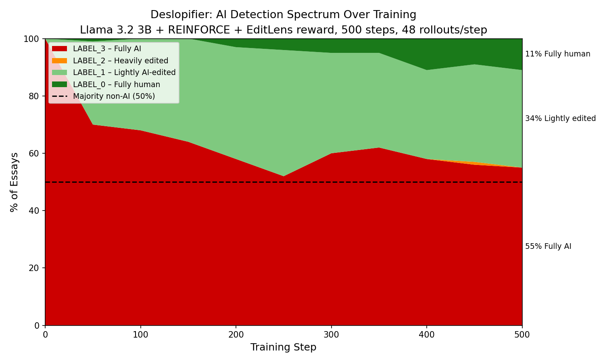

# STAT 4830 PromptLab Project

This repository contains the PromptLab coursework codebase for studying AI slop,
deslopification, prompt optimization, and tournament-style transformer
fine-tuning experiments.

# PromptLab Deslopifier

A reinforcement learning system that rewrites AI-generated text to reduce its
detectable AI signature while preserving fluency and coherence. The policy model
(Llama 3.2 3B Instruct + LoRA) is trained with REINFORCE against EditLens, an
open-source ordinal AI detection model, as the reward signal.

**Key result:** Mean EditLens score dropped from 0.999 → 0.670 over 500 training
steps. 45% of essays moved out of the fully-AI detection zone. 11% reached the
fully human range.

---

## Table of Contents

1. [Project Overview](#1-project-overview)
2. [Repository Structure](#2-repository-structure)
3. [Environment Setup](#3-environment-setup)
4. [Reproducing Results](#4-reproducing-results)
   - [A1–A3: Pre-Training Validation](#a1a3-pre-training-validation)
   - [C1: Smoke Test](#c1-smoke-test)
   - [C2: Main REINFORCE Training Run](#c2-main-reinforce-training-run)
   - [C4: KL Penalty Ablation](#c4-kl-penalty-ablation)
   - [E1: Multi-Detector Evaluation](#e1-multi-detector-evaluation)
   - [E3: Qualitative Analysis](#e3-qualitative-analysis)
   - [E5: Ternary Progression Chart](#e5-ternary-progression-chart)
5. [Pre-Trained Checkpoint](#5-pre-trained-checkpoint)
6. [Interactive Demo](#6-interactive-demo)
7. [Key Results](#7-key-results)
8. [License and Attribution](#8-license-and-attribution)

---

## 1. Project Overview

AI-generated text is detectable. [EditLens](https://huggingface.co/pangram/editlens_roberta-large)
(Thai et al., ICLR 2026) scores text on a continuous 0–1 scale:

| Label | Meaning | Typical Score |
|---|---|---|
| LABEL_0 | Fully human-written | 0.007–0.035 |
| LABEL_1 | Lightly AI-edited | 0.10–0.43 |
| LABEL_2 | Heavily AI-edited | 0.43–0.76 |
| LABEL_3 | Fully AI-generated | ~0.999 |

This project trains a **Deslopifier** — a language model that rewrites AI-generated
essays to reduce their EditLens score while maintaining fluency and length. The
combined reward is:

```
R(Y) = α × (1 - EditLens(Y))      # detection evasion,  α = 1.0
     + β × fluency_normalized(Y)   # log-prob under frozen Llama 3.2 3B base, β = 0.5
     + γ × length_match(Y)         # penalize truncation, γ = 0.1
```

Training uses REINFORCE with batch advantage normalization (48 rollouts/step,
500 steps, A100 80 GB, ~7 hours).

---

## 2. Repository Structure

```
STAT-4830-PromptLab-project/
│
├── scripts/                        # All training and evaluation scripts
│   ├── probe_editlens.py           # A1: EditLens scoring validation
│   ├── estimate_vram.py            # A3: Memory budget estimation
│   ├── fluency_reward_validation.py # A2: Fluency complementarity validation
│   ├── c1_smoke_test.py            # C1: 10-step smoke test (Qwen 0.5B)
│   ├── c2_reinforce.py             # C2: Main 500-step REINFORCE training
│   ├── c4a_reinforce.py            # C4-a: Ablation with KL penalty = 0.0
│   ├── c4c_reinforce.py            # C4-c: Ablation with KL penalty = 0.5
│   ├── e1_multidetector.py         # E1: Multi-detector evaluation
│   ├── e3_qualitative.py           # E3 v1: Qualitative analysis (greedy, 10 essays)
│   ├── e3_qualitative_v2.py        # E3 v2: Qualitative analysis (sampled, 20 essays)
│   ├── e4_ablation_table.py        # E4: Training progression table
│   ├── e5_ternary_chart.py         # E5: Ternary progression chart
│   └── c4_pareto_chart.py          # C4: KL ablation scatter plot
│
├── outputs/                        # Training logs, eval results, checkpoints, charts
│   ├── c2_eval.jsonl               # C2 eval checkpoints (steps 50–500)
│   ├── c2_log.jsonl                # C2 per-step training log (500 steps)
│   ├── c4a_eval.jsonl              # C4-a eval checkpoints
│   ├── c4c_eval.jsonl              # C4-c eval checkpoints
│   ├── e1_summary.txt              # E1 multi-detector results
│   ├── e1_multidetector.jsonl      # E1 per-essay results
│   ├── e3_qualitative.txt          # E3 v1 before/after pairs
│   ├── e3_qualitative_v2.txt       # E3 v2 before/after pairs
│   ├── e4_ablation_table.md        # Training progression table
│   ├── e5_ternary_progression.png  # Main ternary chart
│   ├── c4_pareto.png               # KL ablation chart
│   └── c2_checkpoints/
│       └── step_500/               # Best checkpoint (LoRA adapter weights)
│           ├── adapter_config.json
│           ├── adapter_model.safetensors
│           └── step.json
│
├── demo/
│   └── deslopifier_demo.ipynb      # Interactive Google Colab demo
│
├── notebooks/                      # Earlier classifier experiments
├── src/hill_climb/                 # Earlier hill-climbing experiments
└── STAT4830_Experiment_Spec_v4.md  # Full experiment specification
```

---

## 3. Environment Setup

### Requirements

- Python 3.11+
- CUDA-capable GPU (A100 80 GB recommended for training; T4 sufficient for inference)
- HuggingFace account with access to:
  - `meta-llama/Llama-3.2-3B` (requires [license acceptance](https://huggingface.co/meta-llama/Llama-3.2-3B))
  - `meta-llama/Llama-3.2-3B-Instruct` (requires [license acceptance](https://huggingface.co/meta-llama/Llama-3.2-3B-Instruct))
  - `pangram/editlens_roberta-large` (open access)

### Installation

```bash
# Clone the repository
git clone https://github.com/braden-j/STAT-4830-PromptLab-project.git
cd STAT-4830-PromptLab-project

# Install dependencies
pip install transformers peft datasets accelerate tqdm pyyaml \
    einops scikit-learn sentencepiece psutil huggingface_hub \
    matplotlib scipy

# Set PYTHONPATH so scripts can import from each other
export PYTHONPATH=$PWD/scripts:$PYTHONPATH

# Log in to HuggingFace
python -c "from huggingface_hub import login; login()"
```

### Verify Setup

```bash
python -c "import transformers, peft, datasets, accelerate; print('All imports OK')"
python -c "import torch; print('CUDA:', torch.cuda.is_available(), '| GPU:', torch.cuda.get_device_name(0) if torch.cuda.is_available() else 'none')"
```

---

## 4. Reproducing Results

All scripts are run from the **repo root** with `PYTHONPATH` set as above.
Expected runtimes are for an A100 80 GB GPU.

---

### A1–A3: Pre-Training Validation

These confirm that the reward components are correctly implemented before any
training. No GPU required for A1/A3; T4 sufficient for A2.

**A1 — EditLens probe** (~5 minutes):
```bash
python scripts/probe_editlens.py
```
Confirms the canonical EditLens inference formula and real score ranges
(human ~0.007–0.035, raw AI ~0.999).

**A2 — Fluency complementarity** (~30 minutes):
```bash
python scripts/fluency_reward_validation.py
```
Computes Pearson r and Spearman ρ between EditLens and fluency signals.
Expected output: Pearson r ≈ +0.303 (p < 0.05), Spearman ρ ≈ +0.458 (p < 0.001).
Saves `outputs/fluency_vs_editlens.png`.

**A3 — Memory budget** (~1 minute):
```bash
python scripts/estimate_vram.py
```
Confirms full model stack fits in ~14.9 GB VRAM on A100.

---

### C1: Smoke Test

A 10-step REINFORCE run using Qwen 0.5B as the policy to confirm the full
pipeline executes correctly before committing to the 500-step production run.
Requires GPU. Expected runtime: ~15 minutes.

```bash
python scripts/c1_smoke_test.py
```

**Expected output:**
```
 step  mean_reward  grad_norm              rejected
    1       0.XXXX     0.XXXX     0/5 none
   ...
   10       0.XXXX     0.XXXX     0/5 none

  LoRA parameters changed from step 0: True
```

All 7 checklist items should pass: finite rewards, grad norms in [1e-4, 10],
LoRA changed, filter fired correctly.

---

### C2: Main REINFORCE Training Run

The primary 500-step training run. Requires A100 80 GB.
Expected runtime: ~7 hours.

```bash
mkdir -p outputs
python -u scripts/c2_reinforce.py
```

**To resume from a checkpoint** (if interrupted):
```bash
python -u scripts/c2_reinforce.py --resume
```

**Key hyperparameters** (all locked in script constants):

| Parameter | Value |
|---|---|
| Policy model | `meta-llama/Llama-3.2-3B-Instruct` |
| LoRA rank / alpha | 16 / 32 |
| LoRA targets | q_proj, k_proj, v_proj, o_proj |
| Reward weights α, β, γ | 1.0, 0.5, 0.1 |
| KL penalty | 0.1 |
| Batch size (rollouts/step) | 48 |
| Learning rate | 1e-5 |
| Steps | 500 |
| Eval every | 50 steps |
| Checkpoint every | 100 steps |
| Max input / output tokens | 512 / 512 |

**Outputs produced:**

| File | Contents |
|---|---|
| `outputs/c2_log.jsonl` | Per-step: step, mean_reward, grad_norm, n_rejected |
| `outputs/c2_eval.jsonl` | Per-eval: step, mean_editlens, mean_fluency, kl_div, label_dist |
| `outputs/c2_checkpoints/step_NNN/` | LoRA adapter weights at steps 100, 200, 300, 400, 500 |

**Monitoring training** — watch these signals at each 50-step eval:
- `mean_editlens` should decrease over time (target: below 0.700 by step 500)
- `kl_div` should stay below ~1.0 (above 1.0 indicates reward hacking)
- `n_rejected` should stay low (high rejection rate indicates reward hacking)

**Expected results** (from saved `outputs/c2_eval.jsonl`):

| Step | Mean EditLens | LABEL_0% | LABEL_1% | LABEL_3% |
|---|---|---|---|---|
| 0 (baseline) | 0.999 | 0% | 0% | 100% |
| 250 | 0.682 | 4% | 44% | 52% |
| 500 | 0.670 | 11% | 34% | 55% |

---

### C4: KL Penalty Ablation

Two additional runs varying only the KL penalty weight. Each requires A100 80 GB
and runs for ~7 hours. Can be run in parallel on separate machines.

**C4-a — No KL penalty (KL = 0.0):**
```bash
python -u scripts/c4a_reinforce.py
```
Outputs to `outputs/c4a_*.jsonl` and `outputs/c4a_checkpoints/`.

**C4-c — Strong KL penalty (KL = 0.5):**
```bash
python -u scripts/c4c_reinforce.py
```
Outputs to `outputs/c4c_*.jsonl` and `outputs/c4c_checkpoints/`.

**Generate the KL ablation chart** (requires all three eval files):
```bash
python scripts/c4_pareto_chart.py
```
Saves `outputs/c4_pareto.png`.

**Expected results at step 500:**

| Run | KL Penalty | Mean EditLens | KL div | Interpretation |
|---|---|---|---|---|
| C4-a | 0.0 | 0.633 | 0.637 | Valid — batch normalization sufficient |
| C2 | 0.1 | 0.670 | 0.518 | Valid — stable training |
| C4-c | 0.5 | 0.431 | 3.735 | **Reward hacking** — KL explosion |

C4-c's low EditLens score is an artifact of reward hacking, not genuine improvement.
The KL divergence of 3.735 (7× higher than C2) is the diagnostic signal.

---

### E1: Multi-Detector Evaluation

Evaluates the step_500 checkpoint against EditLens and a perplexity-based
secondary detector. Requires GPU (T4 sufficient). Expected runtime: ~30 minutes.

```bash
python scripts/e1_multidetector.py
```

Outputs:
- `outputs/e1_multidetector.jsonl` — per-essay results
- `outputs/e1_summary.txt` — mean scores table

**Expected results:**

| Metric | Original | Rewrite |
|---|---|---|
| Mean EditLens | 0.990 | 0.817 |
| Mean perplexity | 10.94 | 57.10* |

*Perplexity mean is dominated by 2 outlier essays with degenerate outputs
(PPL 152 and 862). Excluding outliers, perplexity decreases slightly,
indicating genuine rewrites are more fluent than originals.

---

### E3: Qualitative Analysis

Generates before/after essay pairs from the step_500 checkpoint.
Requires GPU (T4 sufficient). Expected runtime: ~20 minutes.

**Version 2 (recommended — 20 essays, temperature sampling):**
```bash
python scripts/e3_qualitative_v2.py
```
Saves `outputs/e3_qualitative_v2.txt`.

**Version 1 (10 essays, greedy decoding — for reference):**
```bash
python scripts/e3_qualitative.py
```
Saves `outputs/e3_qualitative.txt`.

The v2 run identified three behavioral patterns:
- **Genuine targeted editing** (~4–6/20 essays): vivid verbs, sensory grounding, naturalized dialogue
- **Reward hacking** (~6/20 essays): partial rewrites followed by repetitive tokens
- **No change** (~8/20 essays): output nearly identical to input

Best examples of genuine learning: Essay 2 (Paris Liberation) and Essay 16
(detective fiction, EditLens 0.9922 → 0.5943).

---

### E5: Ternary Progression Chart

Generates the main training visualization from the C2 eval log.
No GPU required. Expected runtime: <1 minute.

```bash
python scripts/e5_ternary_chart.py
```

Saves `outputs/e5_ternary_progression.png`. Requires `outputs/c2_eval.jsonl`
to exist (produced by C2 training run or pre-saved in repo).

---

## 5. Pre-Trained Checkpoint

The step_500 LoRA checkpoint from the C2 training run is saved in the repo at
`outputs/c2_checkpoints/step_500/`. To load it for inference:

```python
import torch
from peft import PeftModel
from transformers import AutoModelForCausalLM, AutoTokenizer

POLICY_MODEL_ID = "meta-llama/Llama-3.2-3B-Instruct"
CHECKPOINT_PATH = "outputs/c2_checkpoints/step_500"

tokenizer = AutoTokenizer.from_pretrained(POLICY_MODEL_ID)
base = AutoModelForCausalLM.from_pretrained(
    POLICY_MODEL_ID,
    torch_dtype=torch.bfloat16,
    low_cpu_mem_usage=True,
)
model = PeftModel.from_pretrained(base, CHECKPOINT_PATH, is_trainable=False)
model = model.cuda().eval()

SYSTEM_PROMPT = (
    "You are a skilled human writing editor. Rewrite the following text to "
    "sound more like it was written by a thoughtful human. Make targeted, "
    "precise edits. Preserve the core meaning and approximate length."
)

def deslopify(text):
    messages = [
        {"role": "system", "content": SYSTEM_PROMPT},
        {"role": "user", "content": text},
    ]
    prompt = tokenizer.apply_chat_template(
        messages, tokenize=False, add_generation_prompt=True
    )
    inputs = tokenizer(prompt, return_tensors="pt", truncation=True,
                       max_length=512).to("cuda")
    prompt_len = inputs["input_ids"].shape[1]
    with torch.no_grad():
        out = model.generate(
            **inputs, max_new_tokens=512, do_sample=False,
            pad_token_id=tokenizer.eos_token_id,
        )
    gen_ids = out[0, prompt_len:]
    return tokenizer.decode(gen_ids, skip_special_tokens=True).strip()
```

---

## 6. Interactive Demo

An end-to-end demonstration notebook is available at `demo/deslopifier_demo.ipynb`.

[](https://colab.research.google.com/github/braden-j/STAT-4830-PromptLab-project/blob/main/demo/deslopifier_demo.ipynb)

The notebook:
1. Installs dependencies and loads the step_500 checkpoint
2. Runs three example AI-generated essays through the deslopifier
3. Shows before/after text and EditLens scores side by side
4. Includes a cell for trying your own text
5. Displays the training results summary and E5 ternary chart

**Note:** Requires a HuggingFace account with Meta Llama license accepted.
A GPU runtime is recommended (Runtime → Change runtime type → T4 GPU).

---

## 7. Key Results

### Training Progression (C2 — 500 steps, A100 80 GB)

| Step | Mean EditLens | LABEL_0% | LABEL_1% | LABEL_3% | KL div |
|---|---|---|---|---|---|
| 0 (base) | 0.999 | 0% | 0% | 100% | 0.000 |
| 50 | 0.768 | 1% | 29% | 70% | 0.397 |
| 150 | 0.754 | 0% | 36% | 64% | 0.457 |
| 250 | 0.682 | 4% | 44% | 52% | 0.513 |
| 500 | **0.670** | **11%** | **34%** | **55%** | 0.518 |

**Δ (0 → 500): −0.329 EditLens, −45% LABEL_3, +34% LABEL_1, +11% LABEL_0**

### KL Penalty Ablation (C4)

| Run | KL Penalty | Mean EditLens | KL div |
|---|---|---|---|
| C4-a | 0.0 | 0.633 | 0.637 |
| **C2** | **0.1** | **0.670** | **0.518** |
| C4-c | 0.5 | 0.431* | 3.735* |

*C4-c: reward hacking — KL explosion indicates model left well-behaved training regime.

### Ternary Progression Chart



---

## 8. License and Attribution

**EditLens** is released under [CC BY-NC-SA 4.0](https://creativecommons.org/licenses/by-nc-sa/4.0/)
by Pangram Labs. This project uses EditLens for **non-commercial academic research only**.
Any use of this codebase that incorporates EditLens must comply with the CC BY-NC-SA 4.0 license.

**Llama 3.2** is released by Meta AI under the
[Llama 3.2 Community License](https://www.llama.com/llama3_2/license/).
Use requires accepting Meta's license terms on HuggingFace.

**Citation:**

If you use this work, please cite:

```
@misc{promptlab2026deslopifier,
  title   = {PromptLab Deslopifier: RL-Based AI Text Humanization with EditLens},
  author  = {PromptLab, STAT 4830},
  year    = {2026},
  note    = {STAT 4830, University of Pennsylvania}
}
```

**EditLens paper:**
```
@inproceedings{thai2026editlens,
  title     = {EditLens: Quantifying the Extent of AI Editing in Text},
  author    = {Thai, Khanh and Emi, Brendan and Masrour, Farhan and Iyyer, Mohit},
  booktitle = {ICLR},
  year      = {2026},
  note      = {arXiv:2510.03154}
}
```

---

*STAT 4830 — Numerical Optimization for Data Science and ML*
*University of Pennsylvania / Wharton, Spring 2026*


## Tournament Phase 1

The current tournament workflow lives in:

- `tournament/`
- `src/hill_climb/tournament/`

Key entrypoints:

- `tournament/scripts/verify_access.py`
- `tournament/scripts/build_source_pool.py`
- `tournament/scripts/build_p0_pairs.py`
- `tournament/scripts/train_sft.py`
- `tournament/scripts/train_dpo.py`
- `tournament/scripts/eval_checkpoint.py`
- `tournament/scripts/run_phase1_dual_gpu.sh`

Supporting documentation:

- `tournament/IMPLEMENTATION_PLAN.md`
- `tournament/PRIME_RUNBOOK.md`

## Install

For the tournament workflow:

```bash
pip install -e .[tournament]
```

## Notes

- Hugging Face and W&B credentials are expected via environment variables.
- Heavy model artifacts and checkpoints should be stored on remote compute or
  persistent disks rather than committed to GitHub.
